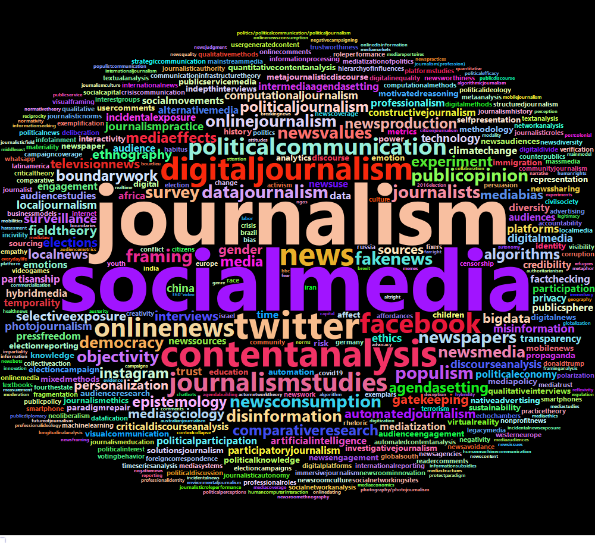

```{r, setup, include=FALSE}
library(mosaic)
library(readr)
library(ggplot2)
library(knitr)
library(wordcloud)
library(RColorBrewer)
library(wordcloud2)
library(tidytext)
library(htmlwidgets)
library(webshot)
library(kableExtra)
source("litrev_funcs.R")
set.seed(4)

knitr::opts_chunk$set(
  tidy=FALSE,     # display code as typed
  size="small")   # slightly smaller font for code
```

This report is an exploratory data analysis of the keywords for all articles published between 2018-2021 (as of 2/14/21) from the journals Political Communication, Journalism, Journalism Studies, Digital Journalism, Journalism & Mass Media, International Journal of Press & Politics, and New Media & Society (Journal of Communication was excluded because it is published by Oxford Academic which doesn't have keywords on their journal homepages). The keywords and some relevant article info were scraped from [Taylor and Francis](https://taylorandfrancis.com/) and [Sagepub](https://journals.sagepub.com/) using the python package Beautiful Soup 4. A sample of the data set is shown below:

*Titles may not be complete


```{r, include=FALSE}
keywords_tf <- read_csv('keywords.csv') %>% select(-X1)
keywords_sage<- read_csv('keywords2.csv') %>% select(-X1)
keywords_tf_18 <- read_csv('keywords_2018.csv') %>% select(-X1)
keywords_sage_18 <- read_csv('keywords2_2018.csv') %>% select(-X1)

keywords <- rbind(keywords_tf, keywords_sage, keywords_tf_18, keywords_sage_18) %>%
  unique()

keywords18 <- keywords %>%
  filter(published == 2018)
keywords19 <- keywords %>%
  filter(published == 2019)
keywords20 <- keywords %>%
  filter(published == 2020)
keywords21 <- keywords %>%
  filter(published == 2021)

t1 <- kable(sample(keywords, 5) %>% select(-'orig.id'), format = 'markdown')
```

```{r, include=FALSE}
jc18 <- journal_comp(keywords18, 2018)
jc19 <- journal_comp(keywords19, 2019)
jc20 <- journal_comp(keywords20, 2020)
jc21 <- journal_comp(keywords21, 2021)
```

```{r, include=FALSE}
jc18
jc19
jc20
jc21
```


```{r, echo=FALSE}
t1
```

```{r, include=FALSE}
keylist <- key_list(keywords)
keylist18 <- key_list(keywords18)
keylist19 <- key_list(keywords19)
keylist20 <- key_list(keywords20)
keylist21 <- key_list(keywords21)

article_count <- c(nrow(keywords18), nrow(keywords19), nrow(keywords20),  nrow(keywords21),nrow(keywords))
keyword_count <- c(sum(keylist18$count), sum(keylist19$count), sum(keylist20$count), sum(keylist21$count), sum(keylist$count))
unique_keyword_count <- c(nrow(keylist18), nrow(keylist19), nrow(keylist20), nrow(keylist21), nrow(keylist))

quick_nums <- kable(data.frame(article_count, 
                               keyword_count, 
                               unique_keyword_count, 
                               row.names = c('2018', '2019', '2020', '2021', 'total')), 
                    format = 'markdown')

wc_dist <- keylist %>%
  gf_histogram(~count, fill = 'blue', bins = 200) %>%
  gf_labs(x = 'word counts') %>%
  gf_theme()
```

## Quick Numbers:

Here you can see that there are significantly more articles in 2018 than there were in 2019 or 2020. This is primarily because New Media & Society began publishing significantly less articles per issue after 2018.

```{r, echo=FALSE}
quick_nums
```

### Distribution of Word Counts for all Years

The majority of keywords only appear once. However, there are a few clear outliers that appear frequently in this dataset. 

<center>

```{r, echo=FALSE}
wc_dist
```

</center>

## Keyword Word Cloud for All Years

```{r, include=FALSE}
#word_cloud(keywords, '')
#word_cloud(keywords18, 2018)
#word_cloud(keywords19, 2019)
#word_cloud(keywords20, 2020)
#word_cloud(keywords21, 2021)
```

<center>



</center>

## List of all Keywords with Ten or More Occurences in the Total Dataset

*count*: the number of times the keywords appears in the dataset

*perc*: the percent of articles that the keyword is on

```{r, include=FALSE}
all5 <- keylist %>%
  mutate(perc = round(count / nrow(keywords) * 100, 2)) %>%
  arrange(-count) %>%
  filter(count >= 10) %>%
  kable(format = 'markdown')
```

```{r, echo=FALSE}
all5
```

## 20 Most Frequent Keywords by Year

It's clear that 'social media' and 'journalism' are by far the most used keyword. Additionally, we can see that many popular keywords reflect the increasingly digital landscape and its importance for politics (e.g. 'twitter', 'political communication', 'fakenews')

These charts all show the 20 most popular keywords for each year by the number of times they appear on an article.

<center>

```{r, include=FALSE}
mf18 <- most_frequent(keylist18, 2018, 20)
mf19 <- most_frequent(keylist19, 2019, 20)
mf20 <- most_frequent(keylist20, 2020, 20)
mf21 <- most_frequent(keylist21, 2021, 20)
```

```{r, echo=FALSE}
mf18
mf19
mf20
mf21
```


</center>

## Keywords that Increased in frequency from 2018 to 2019 and 2019 to 2020

The most interesting value here (and what the list is ordered by) is *freq_incr* which is the factor by which a keywords frequency increased from 2018 to 2020. This is an indicator of increasing popularity and may help predict what will be popular in 2021.

*count*: these are the count of articles with this keyword for each respective year

*perc*: these are teh percent of articles with this keyword for each respective year

*freq_incr*: this is the factor by which a keywords frequency increased from 2018 to 2020

```{r, include=FALSE}
k18 <- keylist18 %>%
  mutate(year = 2018,
         perc = count / nrow(keywords18))

k19 <- keylist19 %>%
  mutate(year = 2019,
         perc = count / nrow(keywords19))

k20 <- keylist20 %>%
  mutate(year = 2020,
         perc = count / nrow(keywords20))

k21 <- keylist21 %>%
  mutate(year = 2021,
         perc = count / nrow(keywords21))

key_lat <- rbind(k18, k19, k20, k21) %>%
  arrange(-perc)

kl18 <- keylist18 %>%
  mutate(count18 = count,
         perc18 = count / nrow(keywords18)) %>%
  select(-count)

kl19 <- keylist19 %>%
  mutate(count19 = count,
         perc19 = count / nrow(keywords19)) %>%
  select(-count)

kl20 <- keylist20 %>%
  mutate(count20 = count,
         perc20 = count / nrow(keywords20)) %>%
  select(-count)

kl21 <- keylist21 %>%
  mutate(count21 = count,
         perc21 = count / nrow(keywords21)) %>%
  select(-count)

increase18_20 <- kl18 %>%
  full_join(kl19) %>%
  full_join(kl20) %>%
  full_join(kl21) %>%
  filter(perc18 < perc19,
         perc19 < perc20) %>%
  mutate(perc18 = round(perc18*100, 2),
         perc19 = round(perc19*100, 2),
         perc20 = round(perc20*100, 2),
         perc21 = round(perc21*100, 2),
         freq_incr = round(perc20 / perc18, 2),
         freq_incr2 = round(perc20 / perc19, 2))

growers <- increase18_20 %>%
  arrange(-freq_incr2) %>%
  head(15)
```

```{r, echo=FALSE}
increase18_20 %>%
  arrange(-freq_incr2) %>%
  kable(format = 'markdown')
```

```{r, include=FALSE}
change_plot <- key_lat %>%
  filter(words %in% growers$words,
         year != 2021) %>%
  mutate(year = factor(year, levels = c(2020, 2019, 2018)),
         perc = round(perc * 100, 2)) %>%
  gf_bar(reorder(words, -perc) ~ perc, 
         stat = 'identity', 
         fill = ~year, 
         position = 'dodge') %>%
  gf_labs(y = 'keywords', x = '% of articles with keyword')
```

## The Keywords that Increase Most in Popularity from 2018 to 2020

<center>

```{r, echo=FALSE}
change_plot
```

</center>

## Keyword Groups

The groups were formed by going through the list of keywords and grouping together ones that related to each other topically or were synonymous. However, this process was imperfect so these results are likely biased in some way. You can see from the below histogram that the distribution of keyword groups is similar but a bit more evenly spread.

```{r, include=FALSE}
groupkey <- read_csv('group.csv')

groups <- unlist(groupkey$group)
names(groups) <- groupkey$words

grouped_increasers <- kl18 %>%
  full_join(kl19) %>%
  full_join(kl20) %>%
  full_join(kl21) %>%
  mutate(group = groups[words]) %>%
  select(-words) %>%
  group_by(group) %>%
  mutate(count18 = sum(count18, na.rm = T),
         perc18 = sum(perc18, na.rm = T),
         count19 = sum(count19, na.rm = T),
         perc19 = sum(perc19, na.rm = T),
         count20 = sum(count20, na.rm = T),
         perc20 = sum(perc20, na.rm = T),
         count21 = sum(count21, na.rm = T),
         perc21 = sum(perc21, na.rm = T),
         freq_incr = round(perc20 / perc18, 2),
         perc18 = round(perc18*100, 2),
         perc19 = round(perc19*100, 2),
         perc20 = round(perc20*100, 2),
         perc21 = round(perc21*100, 2)) %>%
  unique() %>%
  ungroup() %>%
  filter(perc18 < perc19,
         perc19 < perc20) %>%
  mutate(freq_incr = if_else(is.infinite(freq_incr), as.double(count20), freq_incr)) %>%
  arrange(-freq_incr)

grouped_growers <- grouped_increasers %>%
  arrange(-freq_incr) %>%
  head(15)
```

Number of Keywords: `r nrow(keylist)`

Number of Keyword Groups: `r groupkey %>% select(group) %>% unique() %>% nrow()`

```{r, include = FALSE}
grouped_wc_dist <- keylist %>%
  mutate(group = groups[words]) %>%
  group_by(group) %>%
  mutate(count = sum(count, na.rm = T)) %>%
  select(group, count) %>%
  ungroup() %>%
  unique() %>%
  gf_histogram(~count, fill = 'blue', bins = 200) %>%
  gf_labs(x = 'group occurence counts') %>%
  gf_theme()
```

```{r, echo=FALSE}
grouped_wc_dist
```
## Keyword Groups that Increased in frequency from 2018 to 2019 and 2019 to 2020

This table is the same as the previous one with keywords but uses keyword groups.

```{r, echo=FALSE}
grouped_increasers %>%
  arrange(-freq_incr) %>%
  select(group, count18, perc18, count19, perc19, 
         count20, perc20, count21, perc21, freq_incr) %>%
  kable(format = 'markdown')
```

## The Keyword Groups that Increase Most in Popularity from 2018 to 2020

<center>

```{r, include=FALSE}
grouped_change_plot <- key_lat %>%
  mutate(group = groups[words]) %>%
  select(-words) %>%
  group_by(group, year) %>%
  mutate(count = sum(count, na.rm = T),
         perc = sum(perc, na.rm = T)) %>%
  ungroup() %>%
  filter(group %in% grouped_growers$group,
         year != 2021) %>%
  mutate(year = factor(year, levels = c(2020, 2019, 2018)),
         perc = round(perc * 100, 2)) %>%
  gf_bar(reorder(group, -perc) ~ perc, 
         stat = 'identity', 
         fill = ~year, 
         position = 'dodge') %>%
  gf_labs(y = 'keywords', x = '% of articles with keyword')
```

```{r, echo=FALSE}
grouped_change_plot
```

</center>

Top 25 Keywords and Keyword Groups

In grouping the keywords we can see some of the same trends as identified in the original keyword trends such as "incidental" and "epistemic", and "textanalysis". However, some interesting new ones emerge such as "crosscountry", "ecological", and "advocacy". 

```{r, include=FALSE}
top_key <- increase18_20 %>%
  arrange(-freq_incr) %>%
  select(words, freq_incr) %>%
  head(25)

top <- grouped_increasers %>%
  arrange(-freq_incr) %>%
  select(group, freq_incr) %>%
  head(25) %>%
  mutate(word = top_key$words,
         word_increase = top_key$freq_incr) %>%
  rename(group_increase = freq_incr) %>%
  select(word, word_increase, group, group_increase)
```

```{r}
top %>%
  kable(format = 'markdown')
```

