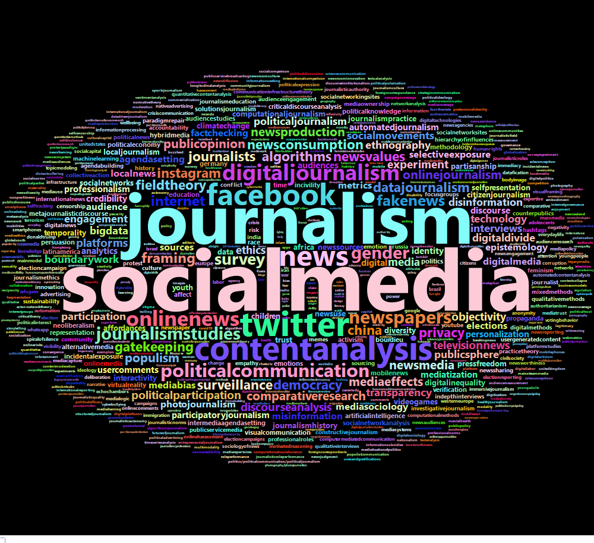

```{r, setup, include=FALSE}
library(mosaic)
library(readr)
library(ggplot2)
library(knitr)
library(wordcloud)
library(RColorBrewer)
library(wordcloud2)
library(tidytext)
library(htmlwidgets)
library(webshot)
source("litrev_funcs.R")
set.seed(3)

knitr::opts_chunk$set(
  tidy=FALSE,     # display code as typed
  size="small")   # slightly smaller font for code
```

This report is an exploratory data analysis of the keywords for all articles published within 2019-2021 (as of 2/14/21) from the journals Political Communication, Journalism, Journalism Studies, Digital Journalism, Journalism & Mass Media, International Journal of Press & Politics, and New Media & Society (Journal of Communication was excluded because it is published by Oxford Academic which doesn't have keywords on their journal homepages). The keywords and some relevant article info were scraped from [Taylor and Francis](https://taylorandfrancis.com/) and [Sagepub](https://journals.sagepub.com/). A sample of the data set is shown below:

```{r, include=FALSE}
keywords1 <- read_csv('keywords.csv') %>% select(-X1)
keywords2 <- read_csv('keywords2.csv') %>% select(-X1)
keywords <- rbind(keywords1, keywords2) %>%
  unique()
keywords19 <- keywords %>%
  filter(published == 2019)
keywords20 <- keywords %>%
  filter(published > 2019)
t1 <- kable(sample(keywords, 5) %>% select(-'orig.id'), format = 'markdown')
```

```{r, echo=FALSE}
t1
```

```{r, include=FALSE}

flat_keys <- keywords %>%
  mutate(flat_keys = flatten(keywords)) %>%
  select(flat_keys)
flat_keys19 <- keywords19 %>%
  mutate(flat_keys = flatten(keywords)) %>%
  select(flat_keys)
flat_keys20 <- keywords20 %>%
  mutate(flat_keys = flatten(keywords)) %>%
  select(flat_keys)
  
words <- key_clean(unlist(flat_keys$flat_keys))
words19 <- key_clean(unlist(flat_keys19$flat_keys))
words20 <- key_clean(unlist(flat_keys20$flat_keys))

article_count <- c(nrow(keywords19), nrow(keywords20), nrow(keywords))
keyword_count <- c(length(words19), length(words20), length(words))
unique_keyword_count <- c(length(unique(words19)), length(unique(words20)), length(unique(words)))

quick_nums <- kable(data.frame(article_count, 
                               keyword_count, 
                               unique_keyword_count, 
                               row.names = c('2019', '2020-2021', 'total')), 
                    format = 'markdown')

keylist <- data.frame(words) %>%
  group_by(words) %>%
  summarize(count = n())
keylist19 <- data.frame(words19) %>%
  group_by(words19) %>%
  summarize(count = n())
keylist20 <- data.frame(words20) %>%
  group_by(words20) %>%
  summarize(count = n())

wc_dist <- keylist %>%
  gf_density(~count, fill = 'blue') %>%
  gf_labs(x = 'word counts') %>%
  gf_theme()

```

## Quick Numbers:

```{r, echo=FALSE}
quick_nums
```


### Distribution of Word Counts

The majority of keywords only appear once. However, there are a few clear outliers that appear frequently in this dataset. 

<center>

```{r, echo=FALSE}
wc_dist
```

</center>

### 20 Most Frequent Keywords

It's clear that 'social media' and 'journalism' are by far the most used keyword. Additionally, we can see that many popular keywords reflect the increasingly digital landscape and its importance for politics (e.g. 'twitter', 'political communication', 'fakenews')

<center>

```{r, echo=FALSE}
keylist %>%
  arrange(-count) %>%
  head(20) %>%
  gf_col(reorder(words, count) ~ count) %>%
  gf_labs(y = 'keyword')
```

</center>

## Keyword Word Cloud

```{r, include = FALSE}
wc <- keywords %>%
  key_cloud()

wc19 <- keywords19 %>%
  key_cloud()

wc20 <- keywords20 %>%
  key_cloud()
```

```{r, include = FALSE}
saveWidget(wc, 'wc.html', selfcontained = F)
webshot("wc.html","wc.png",vwidth = 1000, vheight = 900, delay =10)

saveWidget(wc19, 'wc19.html', selfcontained = F)
webshot("wc19.html","wc19.png",vwidth = 1000, vheight = 900, delay =10)

saveWidget(wc20, 'wc20.html', selfcontained = F)
webshot("wc20.html","wc20.png",vwidth = 1000, vheight = 900, delay =10)
```

<center>



</center>

## Keywords w/ Biggest Change between 2019 and 2020/21

```{r, include=FALSE}
n_art19 <- nrow(keywords19)
n_art20 <- nrow(keywords20)

key_dense19<- keylist19 %>%
  mutate(words = words19,
         density19 = count / n_art19) %>%
  select(words, density19)

key_dense20 <- keylist20 %>%
  mutate(words = words20,
         density20 = count / n_art20) %>%
  select(words, density20)

change_plot <- key_dense19 %>%
  left_join(key_dense20) %>%
  mutate(density_change = (density20 - density19) * 100,
         abs_change = abs(density_change),
         category = if_else(density_change > 0, 1, 0)) %>%
  arrange(-abs_change) %>%
  head(30) %>%
  select(words, density_change, category) %>%
  gf_col(reorder(words, density_change)~density_change, fill = ~factor(category), show.legend = F) %>%
  gf_labs(x = 'Change in % of Articles w/ keyword from 2019 to 2020/2021', 
          y = 'keyword')
  
```

Perhaps the most interesting information in this plot is the significant change in focus between the two most popular keywords 'social media' and 'journalism'. Social media was used as a keyword for over 5% more articles in 2020/21 than in 2019, while journalism was used as a keyword in about 2.5% less articles. 

<center>

```{r, echo=FALSE}
change_plot
```

</center>

